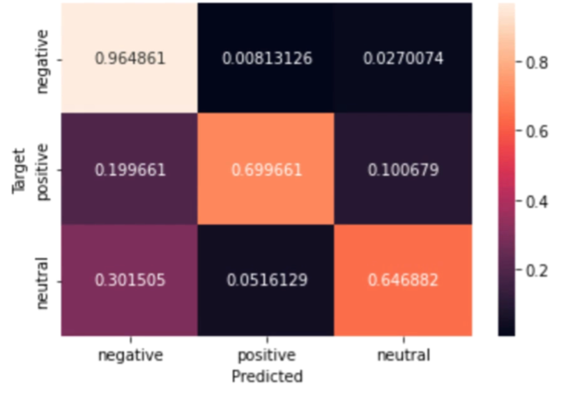
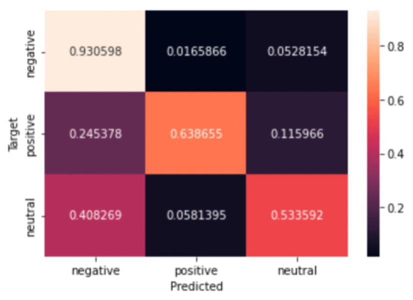

# Logistic Regression Sentiment Analysis

Proyek ini berisi implementasi sederhana **Logistic Regression** untuk sentiment analysis.

---

## 🧠 1. Pendahuluan

Versi Flutter ini mendemonstrasikan bagaimana aplikasi mobile mengirimkan teks ke server (API) kemudian mendapatkan hasil prediksi berbasis **Logistic Regression Multiclass**.

Model memprediksi tiga label:

- 😊 **Positive**
- 😡 **Negative**
- 😐 **Neutral**

---

## 📁 2. Dataset & API

- **Dataset**  
  https://raw.githubusercontent.com/fahmi54321/sentiment_analysis/refs/heads/main/AirlineTweets.csv

- **API Flask (sentiment prediction endpoint)**  
  https://github.com/fahmi54321/sentiment_analysis/blob/main/sentiment_analysis_multiclass_api.py

- **Python Logistic Regression (training code)**  
  https://github.com/fahmi54321/sentiment_analysis/blob/main/sentiment_analysis_multiclass.py

---

## 📊 3. Confusion Matrix (Training Data)

---

## 📊 4. Confusion Matrix (Test Data)

---

## 📱 5. Flutter App

- **Flutter Version**: 3.38.3
- **State Management**: Provider
- Aplikasi menganalisis teks dan menampilkan probabilitas sentiment:
  - Negative
  - Neutral
  - Positive

---
